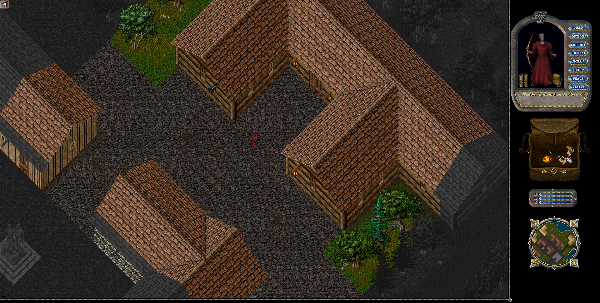

# Giriş

## Çalıştırma

İndirme ve yükleme sonrasında eğer Kurulum yardımcısı üzerinden "Kısayolu masaüstüne oluştur" seçildiyse Masaüstüne sunucunun client kısayolu gelecektir.

Bu kısayol üzerinden Clienti çalıştırabilirsiniz. Eğer "Kısayolu masaüstüne oluştur" seçilmemişse Kurulum dizini olan "C:\UOSoft\\\<SunucuAdı>" konumundaki **client.exe** uygulamasını çalıştırabilirsiniz.

## Güncelleme Ekranı

Bu ekran sadece güncellemeleri kontrol eder ve eğer güncelleme varsa güncellemeleri indirdikten sonra Giriş ekranı adımına otomatik olarak geçer.

## Giriş Ekranı

Bu ekranda daha önceden kayıt olduğunuz hesap adı ve şifrenizi giriş yaparak bir sonra ki sunucu seçme ekranına geçebilirsiniz.

## Sunucu Seçim Ekranı

Bu Sunucu listesinde mevcutta "\<Sunucu Adı>" sunucusunu seçerek bir sonra ki "Karakter Oluşturma" veya "Karakter Seçim" ekranına geçebilirsiniz.

Eğer hesabınızda daha önceden karakter oluşturulmamışsa bu ekrandan sonra direkt olarak "Karakter Oluşturma Ekranı" gidilir, Eğer daha önceden karakter oluşturulmuşsa "Karakter Seçim Ekranı" gidilir.

## Karakter Oluşturma Ekranı

#### Karakter Adı ve Görüntüsü

#### Skill ve Stat Seçimi

Burada Stat toplamı 80, Skill toplamı 100.0 olacak şekilde seçim yapılır.&#x20;

Minimum 2 Skill seçilmesi zorunludur.

#### Başlangıç Şehir Seçimi

Burada karakterinizin oyuna başlayacağı şehir seçilir. Her şehrin kendine has hikayesi ve dokusu vardır. Her şehir bir karakter hikayesine hitab eder. Örneğin craft karakterlerin şehri Minoc olarak kabul edilirken, Magincia şehri büyücüler için idealdir.

## Oyuna Giriş: Merhaba Dünya

<figure><figcaption></figcaption></figure>

Karakter Oluşturduktan sonra artık özgün ve macera dolu dünyaya ilk adımı atmış olacaksınız. Bundan sonrası sizlerin hayalgücü ile sınırlıdır.
